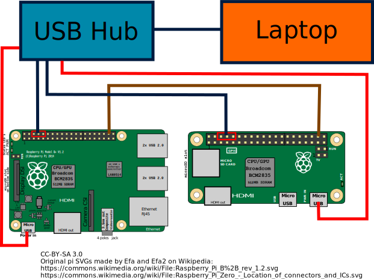

# Labgrid
- Created by Pengutronix
- Developed on GitHub
- Written in Python 3
- LGPL 2.1
- [https://labgrid.readthedocs.io/](https://labgrid.readthedocs.io/)

# Features
- **Abstracts hardware specifics**
```yaml
targets:
  main:
    resources:
      RawSerialPort:
        port: '/dev/ttyUSB0'
    drivers:
      SerialDriver: {}
```
- The YAML files may use `jinja2` templating!

# DEMO TIME
- Raspberry Pi Zero
- Raspberry Pi 2
- GPIO connection between the two
- Power controlled via USB hub
- Labgrid via PyTest

# DEMO TIME
{width=95%}

# Features
- Remote access
- Supports PyTest
- Supports various power switches
- Supports a wide range of protocols etc
- Upload/download files to target

# Use-cases
- Test lab
- Daily development
- CI loop (requires some extra work)

# Unfeatures
- No scheduling
    - You can reserve boards in a distributed environment
- No parallelization support built-in
- It's not a test framework!

# How to use
- Library
- PyTest
- CLI (limited, more useful in a distributed setup)
- Power control can be problematic

# How to use - Getting started

- Install required packages
```bash
$ apt-get install python3 python3-virtualenv \
                  python3-pip virtualenv
$ virtualenv -p python3 labgrid-venv
$ source labgrid-venv/bin/activate
```

- Initialize virtualenv
```bash
$ git clone https://github.com/labgrid-project/labgrid
$ cd labgrid && pip install -r requirements.txt
$ python3 setup.py install
```

# How to use - Library - raw
```python
from labgrid import Target
from labgrid.resource import RawSerialPort
from labgrid.driver import SerialDriver

t = Target('example')
rsp = RawSerialPort(t, name=None, port='/dev/ttyUSB0')
sd = SerialDriver(t, name=None)

-- Write to the serial port
t.activate(sd)
sd.write(b'test')
```

# How to use - Library - env file
```python
from labgrid import Environment
from labgrid.protocol import ConsoleProtocol

env = Environment('example-env.yaml')
t = env.get_target('example')

# get_driver() automatically activates
cp = t.get_driver(ConsoleProtocol)
# Write to the console
cp.write(b'test')
```

# How to use - Pytest
Labgrid exports the `target` and `env` fixtures

```python
import pytest

def test_dummy(target):
    cmd = target.get_driver(ConsoleProtocol)
    stdout, _, _ = cmd.run("uname -a")
    assert 'Linux' in stdout[0]
```

Simply run with **`pytest --lg-env config.yaml`**

# Using labgrid for daily development
- Have a local configuration file
- Run same stuff as your CI/test lab runs
    - Qualify certain tests based on tags
    - Run via ssh or use the distributed setup

# Structure / Architecture
::: incremental

- Resources
- Protocols
- Drivers
- Strategies

:::

# Nice things
- SSH support
- imx loader support
- Android fastboot support
- udev matching (for USB serial on Linux this is gold)
